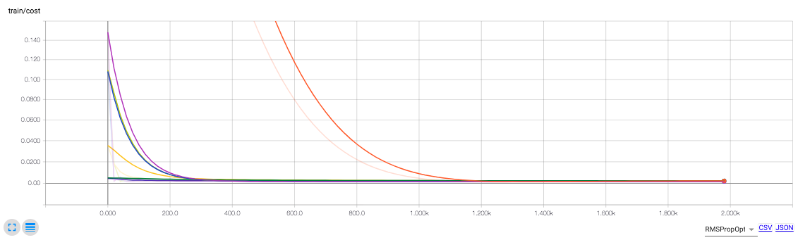
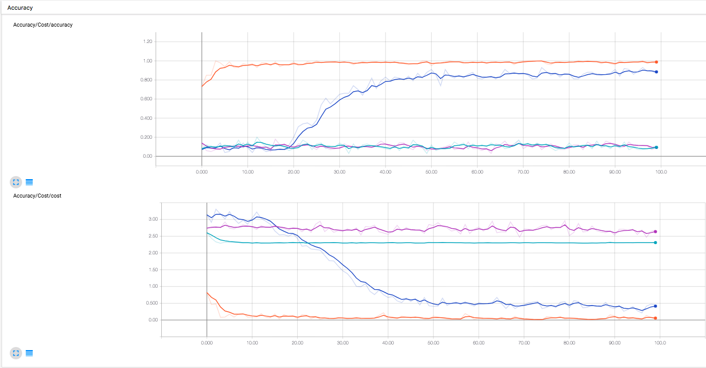

### 실용주의 머신러닝 스터디 4

### [중급] Regression 모델의 데이터를 tensorboard에서 출력 + 개선점 도출 1
- 모델은 본인이 원하는 아무 모델이나 좋습니다.

### [중급] Classification 모델의 데이터를 tensorboard에서 출력 + 개선점 도출 2
- 모델은 본인이 원하는 아무 모델이나 좋습니다.

### [초급] Tensorboard로 3가지 모델의 학습 로그 출력 (Tensorboard 튜토리얼 수준) 
---

### tensorboard 기본 사용법 

```python 

# 출력 대상 지정 
tf.summary.scalar("cost", cost)
tf.summary.scalar("accuracy", accuracy)

# 출력 디렉토리 지정 
merged = tf.summary.merge_all()
writer = tf.summary.FileWriter("linear_reg_tensorboard/%s_%s_%s" % (activation_func.__name__, str(learning_curve), str(epoch)), sess.graph)

for step in range(epoch):
    sess.run(train, feed_dict={X: x_data, Y: y_data})
    if step % 20 == 0:
        summary = sess.run(merged, feed_dict={X: trainX, Y: trainY})
        writer.add_summary(summary, step)
```


### MNIST tensorboard 를 이용한 튜닝

- Activation Function | Learning Rate
    - mnist_<class 'tensorflow.python.training.adam.AdamOptimizer'>_0.01_100
    - mnist_<class 'tensorflow.python.training.adam.AdamOptimizer'>_0.03_100
    - mnist_<class 'tensorflow.python.training.gradient_descent.GradientDescentOptimizer'>_0.001_100
    - mnist_<class 'tensorflow.python.training.gradient_descent.GradientDescentOptimizer'>_0.01_100
    


----
스터디 모임(7/25)
=================

- 여러가지 이미지 넷 
    - VGGNET
    - GOOGLENET
    - INCEPTION ResNet


- 오버피팅(Overfitting)의 경우 accuracy가 올라가다가 내려간다.
- train, test, validation 각각 그리고 판별하자. 

- 근본적인 질문 : accuracy 와 loss(cost)를 보고 어떻게 overfitting, underfitting 을 판단할것인가?


- 튜닝과 모델, 뭐가 안맞나?
  - 모델 : 모델이 검증된것을 쓰면 튜닝을 손본다.
  - 둘중에 하나는 픽스를 해야한다. 

- 잘 만들어 진것을 쓰자.
 
---
RNA 서열과 단백질 결합 <최대식>

---

**Classification 모델의 평가기준 4가지** 
- tt, tp, fn tn 
- Gold Standard


**시계열 예측의 평가 기준** 
- accuracy 가 아닌 다른 기준이 필요 
- MAE
- RMSE(ROOT MEAN SQUARED ERROR)
    - 예측 값과 실측값이 차이의 제곱의 평균값의 루트값
    - 문제 : 크기 의존적 에러 (Scale-dependent errors) : 기준 가격이 달라서 오차 비교가 어렵다 
        
- 비율에러 : MAPE(값이 1과 0값이 작으면 모델이 망가짐)
    - RSME : 10, MAPE = 12/10
    
- 크기의존적 에러 보다는 비율에러를 쓰는게 낮다 
- 크기 조정된 에러(Scaled errors)
- 참고 : https://www.otexts.org/fpp/2/5
- Arima : http://www.dodomira.com/2016/04/21/arima_in_r/

- 비슷한 종류의 데이터끼리 나눠서 트레이닝 하는게 좋다. (게임사의 주식 모델, 제약회사의 주식 모델 )


[머신러닝 분류 문제의 세부 수치 in Tensorflow
](https://dschoiblog.wordpress.com/2017/08/01/%EB%A8%B8%EC%8B%A0%EB%9F%AC%EB%8B%9D-%EB%B6%84%EB%A5%98-%EB%AC%B8%EC%A0%9C%EC%9D%98-%EC%84%B8%EB%B6%80-%EC%88%98%EC%B9%98-in-tensorflow/)